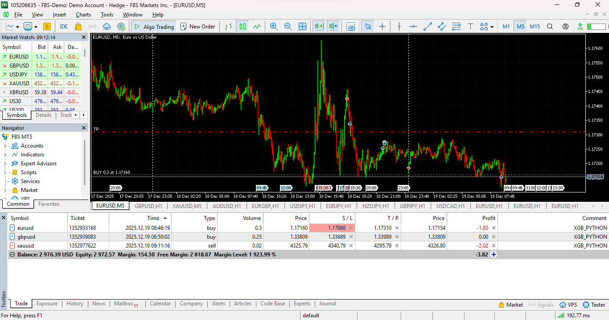

## 🧠 Test Forward XGBoost

### 📦 Dependency

```bash
pip install pandas numpy ta xgboost scikit-learn joblib MetaTrader5
```

#### 1 Copy Training Model From XGB_Training

copy models to model folder XGB_MT5

#### 2 Configuration 

all config inside config.py

#### 3 Run AI XGBoost MT5

```bash
python run.py
```
#### 4 Allow Algo Trading
